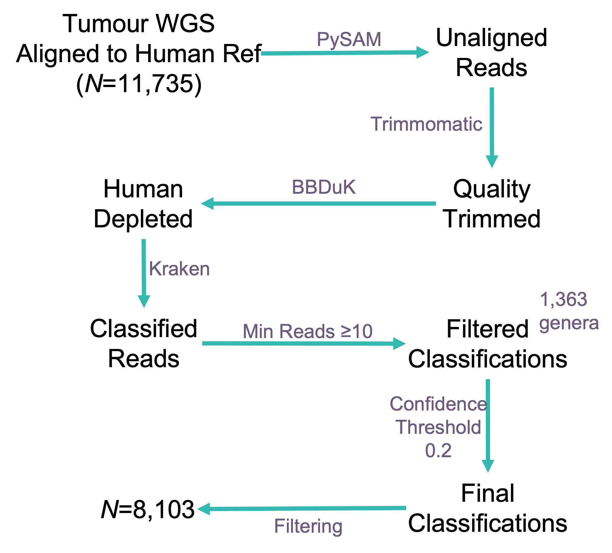
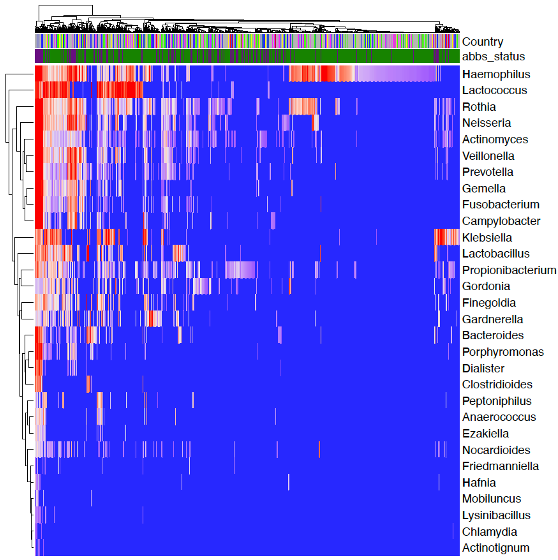
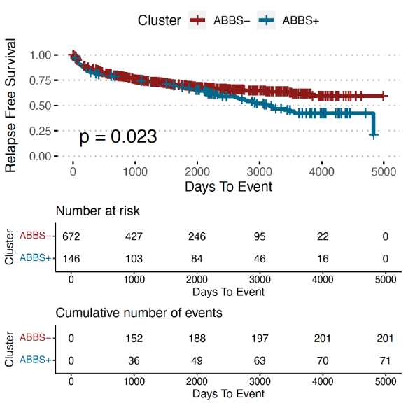
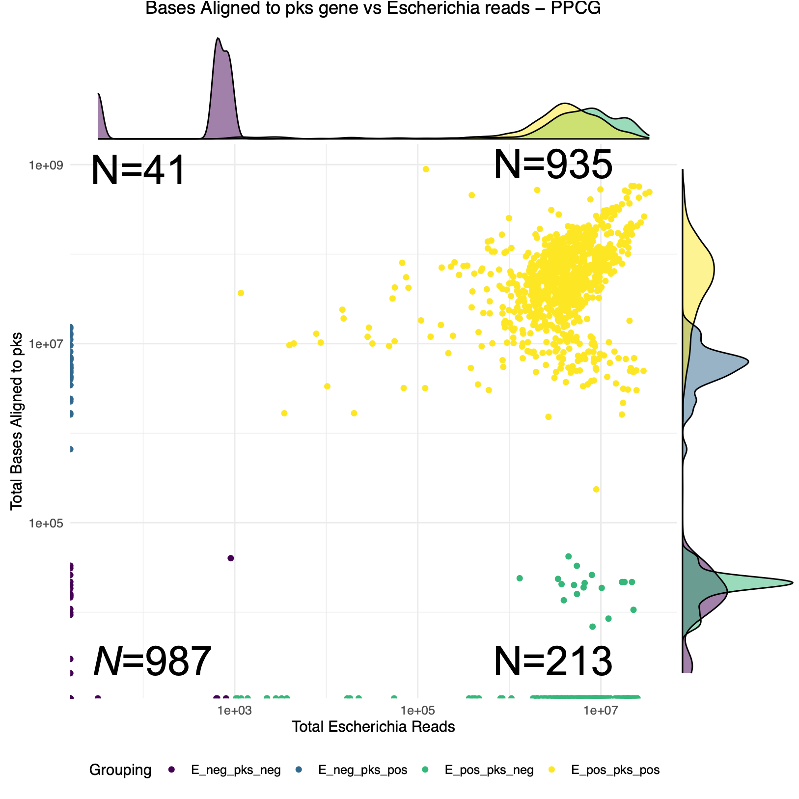

```{r, include=FALSE}
knitr::opts_chunk$set(echo = FALSE,
                      warning = FALSE,
                      tidy = FALSE,
                      message = FALSE,
                      fig.align = 'center',
                      out.width = "100%")
options(knitr.table.format = "html") 
#load/install required libraries

list.of.packages <- c('tidyverse','posterdown','ggpubr', 'devtools', 'kableExtra', 'emo')
new.packages <- list.of.packages[!(list.of.packages %in% installed.packages()[,"Package"])]
if(length(new.packages)) {
 stop('Some packages not installed. please run Rscript install.R')
}

#list.of.packages <- c('tidyverse','posterdown','ggpubr', 'devtools', 'kableExtra')
#new.packages <- list.of.packages[!(list.of.packages %in% installed.packages()[,"Package"])]
#if(length(new.packages)) install.packages(new.packages)

library(posterdown)
library(tidyverse)
library(ggpubr)
library(devtools)
library(kableExtra)

#new.packages <- !(c('emo') %in% installed.packages()[,"Package"])
#if(length(new.packages)) devtools::install_github("hadley/emo")

#load packages required with devtools
library(emo)

#read in required data for plots later


#data frame for contaminant, importance and whether evidence was found in published literature (eisenhofer et al. 2019)
contaminant_rankings <- data.frame( Genus = c("Enterococcus", "Curvibacter", "Methylobacterium", "Sphingomonas", "Variovorax", "Actinomyces", "Bradyrhizobium", "Burkholderia", "Cutibacterium", "Hammondia", "Kocuria", "Micrococcus", "Ralstonia", "Sphingobium", "Streptococcus"),
                                    contaminant_ranking = c(1,2,3,4,5,6,7,8,9,10,11,12,13,14,15),
                                    Literature = c("&#x2705;", "&#x2705;", "&#x2705;","&#x2705;",
                                                   " ",
                                                   "&#x2705;", "&#x2705;","&#x2705;",
                                                   " "," "," "," ","&#x2705;","&#x2705;", "&#x2705;"))


```

# Background


Prostate cancer is the most common cancer in men in the UK with more than 52,000 new diagnoses annually. We recently discovered that a subset of anaerobic bacteria appears to be associated with aggressive prostate cancer – the Anaerobic Bacterial Biomarker Set (ABBS) genera[@Hurst2022]. In this study, we explored whether these findings could be validated in the Pan-Prostate Cancer Group (PPCG, *N*=2,176), using the taxonomic classification of short non-human whole genome sequencing reads. We additionally searched for evidence of the bacterial gene *pks*, which produces genotoxic colibactin, frequently associated with *Escherichia*.


# Methods

```{r, methodsflow, fig.cap="SEPATH was applied to tumour whole genome sequences (WGS, _N_=2,176) from the Pan-Prostate Cancer Group. This pipeline extracts high quality reads unaligned to the human genome, runs additional human read removal and they are subject to taxonomic classification."}

```

To obtain a microbial community matrix for every sample, we applied an adaptation of the ([SEPATH](https://github.com/UEA-Cancer-Genetics-Lab/sepath_tool_UEA) [@RN454] pipeline to whole genome sequences from the PPCG (*N*=2,176). Read counts less than 10 were set to 0 to limit false positive classifications.


#### Survival Analysis

ABBS$^+$ samples were identified in primary tumour samples by identifying any sample with evidence for any of the genera: *Fenollaria*, *Ezakiella*, *Peptoniphilus*, *Porphyromonas*, *Anaerococcus* or *Fusobacterium*. Relapse free survival was measured from date of tumour collection and analysed using the `survminer` and `survival` R packages.

#### Identifying Bacterial *pks*

To search for evidence of bacterial [*pks*](https://www.ncbi.nlm.nih.gov/nuccore/AM229678.1) we aligned unmapped reads from each sample to *pks* gene (`bwa mem`). The resulting BAM files were sorted, indexed and depth reports were obtained with `samtools`. 


# Results

The PPCG reported 1,363 microbial genera with varying levels of evidence. Many of these genera are suspected contaminants, but there some more logical microbial genera with strong levels of evidence (fig. \@ref(fig:ppcg)).

<br>

```{r, ppcg, fig.cap='A heatmap demonstrating a selection of bacteria identified in the urine across the PPCG. Top bars indicate the country from which a smaple was obtained and ABBS status (purple: positive, green: negative).'}

```

<br>

#### ABBS is Associated with Poor Relapse Free Survival in the PPCG

We investigated the association between patients with ABBS$^+$ primary tumour samples and relapse-free survival (fig. \@ref(fig:abbssurv)). ABBS$^+$ patients demonstrated more aggressive disease in terms of relapse free survival ($p=0.023$, log-rank test). We also repeated another finding, that ABBS$^+$ samples are often identified in older participants ($p=5.5x10^{-11}$, Wilcoxon signed-rank test)

<br>

```{r, abbssurv, fig.cap='Survival curves demonstrating relapse free survival in ABBS positive primary tumour samples (blue, n=146) compared with ABBS negative samples (red, n=672). Relapse free survival is significantly worse in patients that demonstrated evidence for ABBS genera (p=0.023, log-rank test).'}

```

<br>

#### Identifying Bacterial *pks* 

A separate pipeline was developed to search for the genotoxic bacterial *pks* gene, which is commonly identified in *Escherichia* (fig. \@ref(fig:pksfig)). We compared the evidence for Escherichia to the total number of bases aligned to the *pks* gene which revealed four clusters:

* *pks*$^+$ and *Escherichia*$^+$ (*N*=935)
* *pks*$^-$ and *Escherichia*$^+$ (*N*=213)
* *pks*$^+$ and *Escherichia*$^-$ (*N*=41)
* *pks*$^-$ and *Escherichia*$^-$ (*N*=987)


```{r, pksfig, fig.cap='The number of reads associated with Escherichia (x-axis) compared with the total number of bases aligned to the pks gene (y-axis) for N=2,176 whole genome sequencing samples in the PPCG cohort.'}

```


# Conclusions

* A range of interesting microbial genera are identified in the PPCG cohort
* ABBS are identified in patients with aggressive prostate cancer
* ABBS are again identified in older participants
* Genotoxic *pks* is identified in 44.8% of samples

# Future Directions

* ABBS is useful at genus level, but what the picture like at species level?
* *Echerichia* can be both a contaminant and also biologically relevant. Is there any evidence for *pks* influencing tumours?

<br>

# Acknowledgements

Thanks to participants, the [PPCG](http://panprostate.org/) and to [Prostate Cancer UK](https://prostatecanceruk.org/) for making this research possible.

```{r, logos, out.width="100%"}
  
```

*Note: * This poster was produced in R. Details and code to reproduce this poster can be found: [github.com/Agihawi/ncrn2023](https://github.com/Agihawi/ncrn2023)

### References
